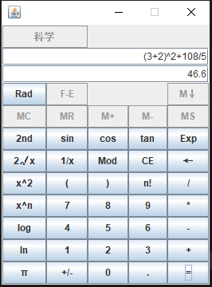
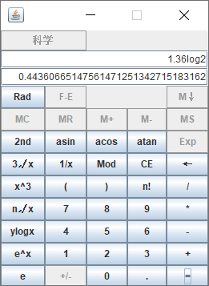
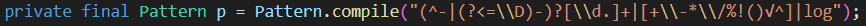

#### 无限精度科学计算器

##### 混合运算展示：



##### 精度展示：




##### 简介：

可以进行**混合运算**，混合运算包括加法+，减法-，乘法*，除法/，取余%，左括号(，右括号)，根号√，对数log，指数^。

如：输入：(3+2)^2+108/5-10log2+3√64

​		输出：47.27807190511263678372

理论可以达到**无限精度**，过高的精度会增加计算时间，需要提前设置精度，即小数点后多少位，默认为32位。


##### 按键功能及使用方法：

|  按键   |           功能           |                           使用方法                           |
| :-----: | :----------------------: | :----------------------------------------------------------: |
|   CE    |           清空           |                     点击该键清空输入输出                     |
|    ←    |           清除           |                   点击该键清除最后一位输入                   |
|   Exp   |         指数表示         |                        正在更新。。。                        |
|   +/-   |         符号切换         |                        正在更新。。。                        |
|    +    |           加法           |  可用于混合运算，输入“被加数”，“+”，“加数”后点击“=”计算结果  |
|    -    |           减法           |                            同加法                            |
|    *    |           乘法           |                            同加法                            |
|    /    |           除法           |                            同加法                            |
|   Mod   |           取余           |             同加法，按键显示为“Mod”,运算符为”%“              |
|    (    |          左括号          |                   用于混合运算，限制优先级                   |
|    )    |          右括号          |                   用于混合运算，限制优先级                   |
| Rad/Deg | 规定三角函数计算时的单位 |   按键显示Rad代表使用弧度单位，按键显示Deg代表使用角度单位   |
|   2nd   |    切换按键的第二功能    | 点击该按键，三角函数切换为反三角函数，指数和对数功能按键也会进行转换 |
|   sin   |       计算正弦函数       |   根据Rad/Deg按键输入对应单位的参数，点击该键直接计算结果    |
|   cos   |       计算余弦函数       |   根据Rad/Deg按键输入对应单位的参数，点击该键直接计算结果    |
|   tan   |       计算正切函数       |   根据Rad/Deg按键输入对应单位的参数，点击该键直接计算结果    |
|  asin   |      计算反正弦函数      |     输入参数，点击该键根据Rad/Deg按键计算对应单位的结果      |
|  acos   |      计算反余弦函数      |     输入参数，点击该键根据Rad/Deg按键计算对应单位的结果      |
|  atan   |      计算反正切函数      |     输入参数，点击该键根据Rad/Deg按键计算对应单位的结果      |
|   2√x   |          平方根          |               输入参数，点击该按键直接计算结果               |
|   3√x   |          立方根          |               输入参数，点击该按键直接计算结果               |
|   x^2   |           平方           |               输入参数，点击该按键直接计算结果               |
|   x^3   |           立方           |               输入参数，点击该按键直接计算结果               |
|   x^n   |          n次方           | 先输入x，点击该键，再输入n，点击“=”计算结果，可用于混合运算。 |
|   n√x   |         n次根下x         | 先输入n，点击该键，再输入x，点击“=”计算结果，可用于混合运算。 |
|   log   |    计算以10为底的对数    |              输入参数，点击该按键直接计算结果。              |
|  ylogx  |      以x为底y的对数      | 先输入y，点击该键，再输入x，点击“=”计算结果，可用于混合运算。 |
|   ln    |    计算以e为底的对数     |              输入参数，点击该按键直接计算结果。              |
|   e^x   |         e的x次方         |              输入参数，点击该按键直接计算结果。              |
|    π    |          圆周率          |    点击该键显示圆周率π的数值，该数值精度与设置精度有关。     |
|    e    |        自然常数e         |   点击该键显示自然常数e的数值，该数值精度与设置精度有关。    |
|   1/x   |           倒数           |               输入参数，点击该键直接计算结果。               |


##### 运算结果精度说明：

程序中使用Java的BigDecimal类实现无限精度，BigDecimal类中自带加法**add()**、减法**subtract()**、乘法**multiply()**、除法**divide()**及整数次方**pow()**函数。

在上述函数基础上自己实现对数函数**log()**、指数函数**pow()**、三角函数**sin()**、**cos()**、**tan()**、**arcsin()**、**arccos()**、**arctan()**、**arccot()**函数，同样可以达到无限精度。


**步骤：**

- 首先实现阶乘函数

  ```java
  public BigDecimal fac(int n)
  ```

- ln(x)的泰勒展开为：
  $$
  \ln (x)=\ln \left(\frac{1+y}{1-y}\right) \quad=2 y\left(\frac{1}{1}+\frac{1}{3} y^{2}+\frac{1}{5} y^{4}+\frac{1}{7} y^{6}+\frac{1}{9} y^{8}+\cdots\right)
  $$
  其中y = (x - 1) / (x + 1)

  在循环中不断累加，如果当前项的值小于设定精度，默认小于10^-32时退出。

  但该展开式只有在x接近1时收敛比较快，如果计算ln(10)经测试大概耗时3s，完全不能忍。

  接下来通过放缩区间加快速度，已知ln(xy)=ln(x)+ln(y)，找一个折中的办法，先将参数x 10倍放缩到[0.5, 5]区间，标记缩放次数为ln10Count，再将参数x 1.1倍缩放到[0.95, 1.05]区间得到x'，标记缩放次数为ln1_1Count，最终结果为ln10Count\*ln(10) + ln1_1Count\*ln(1.1) + ln(x')，该方法需要提前计算ln(10)与ln(1.1)，但计算一次可以永久使用，对于ln(10)转化为10*ln(1.25) + ln(1.073741824)进一步加快速度。

- y log x即以x为底y的对数可转换为log(y)/log(x)

- a^x的泰勒展开式为：
  $$
  a^{x}=e^{x \ln a}=1+\frac{x \ln a}{1 !}+\frac{(x \ln a)^{2}}{2 !}+\frac{(x \ln a)^{3}}{3 !}+\cdots
  $$
  其中需要前面实现的ln(x)

- sin(x)的泰勒展开式为：
  $$
  \sin x=\sum_{n=0}^{\infty} \frac{(-1)^{n}}{(2 n+1) !} x^{2 n+1}=x-\frac{1}{3 !} x^{3}+\frac{1}{5 !} x^{5}-\cdots+\frac{(-1)^{n}}{(2 n+1) !} x^{2 n+1}+\cdots
  $$
  该展开式只能计算[0, PI/2]区间的sin(x)的值，需要先将参数转换到此区间

- cos(x)同理

- tan(x) = sin(x)/cos(x)

- arctan(x)的泰勒展开式为：
  $$
  \arctan x=\sum_{n=0}^{\infty} \frac{(-1)^{n}}{2 n+1} x^{2 n+1}=x-\frac{1}{3} x^{3}+\frac{1}{5} x^{5}+\cdots+\frac{(-1)^{n}}{2 n+1} x^{2 n+1}+\cdots
  $$
  x定义域为实数集，但|x|在接近1或大于1的时候收敛速度特别慢

  解决办法：

  1. 使用arctan(-x) = -arctan(x)，将参数限制到正实数
  2. 如果x>1,根据arctan(x)=PI/2-arctan(1/x),求arctan(1/x)，将参数转换到[0, 1]区间
  3. 但x在接近1时(如0.99)收敛仍然很慢，接下来将参数x限制到[0, 0.5]区间
  4. 如果x>0.5，根据arctan(x)=arctan(y)+arctan((x-y)/(1+xy))，将arctan的参数限制到0.5以下，此处可以选更小的值达到更快的速度

-  arccot(x) = PI/2 - arctan(x)

- arcsin(x) = arctan(x/sqrt(1-x^2))

- arccos(x) = PI/2 - arcsin(x)

  

##### 混合运算实现流程：

- 使用正则表达式提取输入算式的参数和运算符

  用于匹配的正则表达式：



- 将中缀表达式转为后缀表达式

- 对后缀表达式进行计算


##### 更新日志：

- 2020.12.8 20.18

  三角函数仍使用double进行计算，精确到小数点后（16-整数位数）位（如计算atan(80°)=89.28384005452959，即小数位数为16-2位整数位=14位小数位），相当于对double变量表示不了的精度取了个近似值，计算结果不会再出现sin(30°) =0.49999999999999994这种情况。

- 2020.12.10 16.12

  正则表达式进行了优化，加入正后顾可以正确匹配负数和减法，比如对于“2-3”匹配结果应该为（“2”，“-”，“3”），对于“-2--3”匹配结果应该为（“-2”，“-”，“-3”）。

- 2020.12.10 16.12

  对数函数仍使用double进行计算，使用与三角函数相同的方法解决精度问题。

- 2020.12.11 10.46

  结果使用DecimalFormat.format()格式化字符串，三位一体使用“,”分开显示，但输入参数还没有实现，如果要实现的话必须要跟win10计算器一样当参数输入完毕，输入运算符时参数才上移。

- 2020.12.14 19.07

  使用BigDecimal实现常用数学函数，可以达到无限精度

  输出结果三位一体分隔开，便于阅读，输入暂未实现

  

##### 待优化功能：

- 将输入参数和计算结果三位一体使用“,”分隔开，便于阅读，可以使用DecimalFormat.format()函数。
- 三角函数应该有角度制、弧度制、百分度制（梯度制），暂未实现百分度制。
- ~~使用BigDecimal实现对数函数及指数函数求解（log，ln，√，^），这样可以达到任意精度，不再局限于double的精度。~~
- 计算前检查算式的合法性，直接用规则检查比较复杂，可以在混合运算解析的过程中使用try和catch捕获异常，对其他非混合运算算式可直接检查。比如检查反三角函数的输入参数范围可以直接用规则检查，检查阶乘的参数是不是整数二者都可以。


------故里草木深------